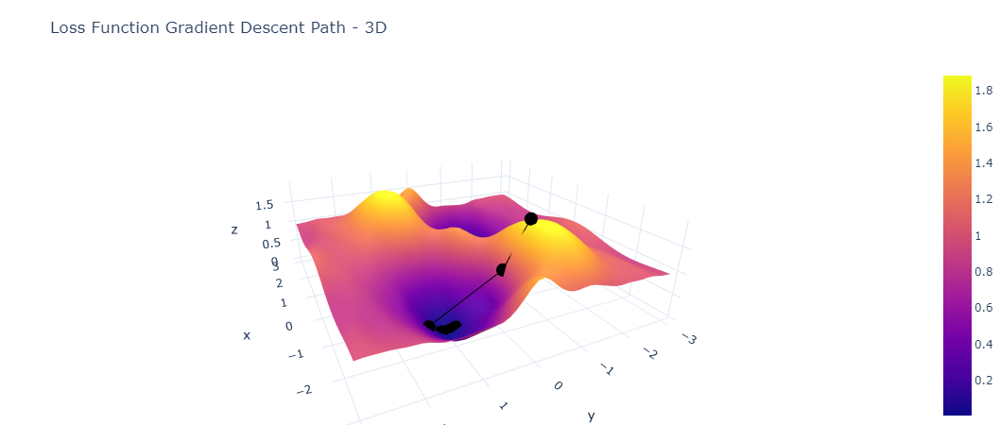
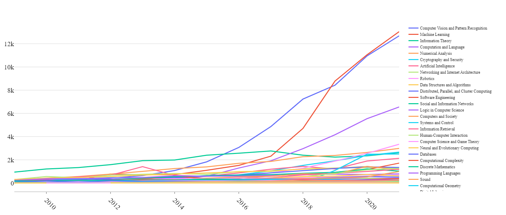
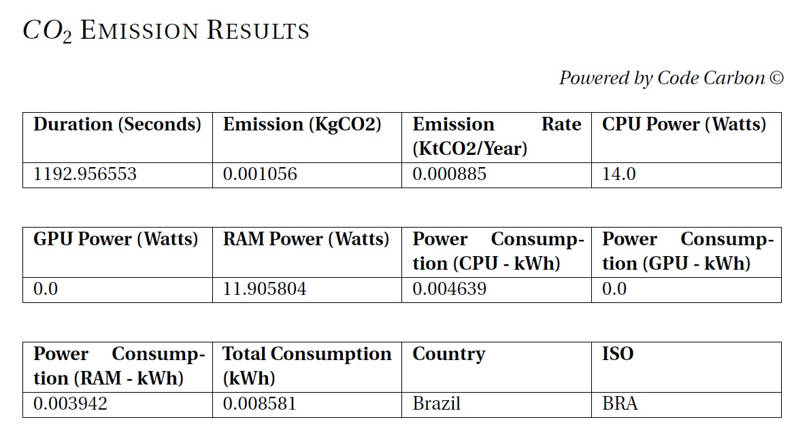
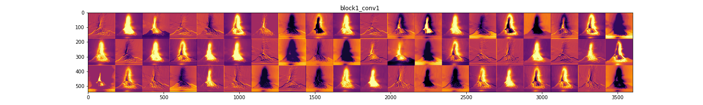
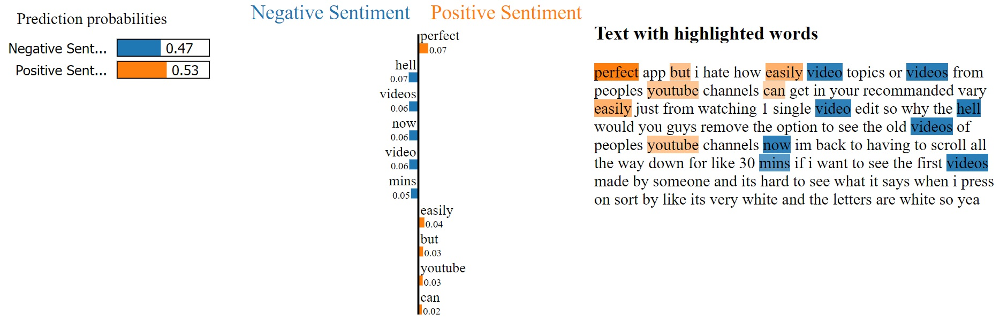
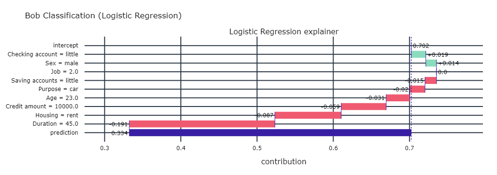
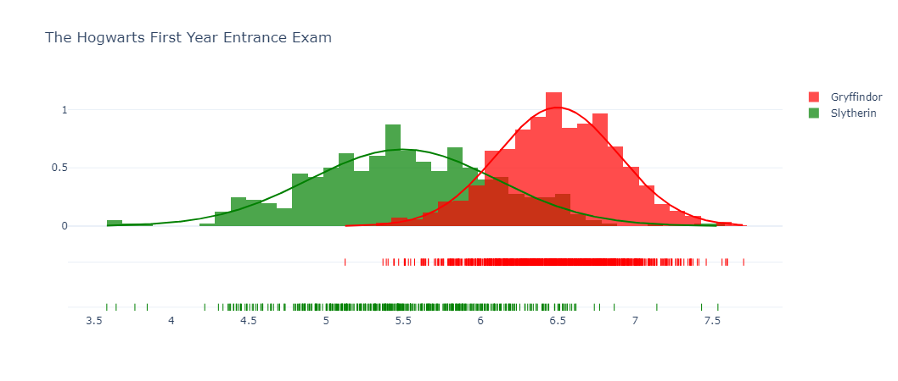
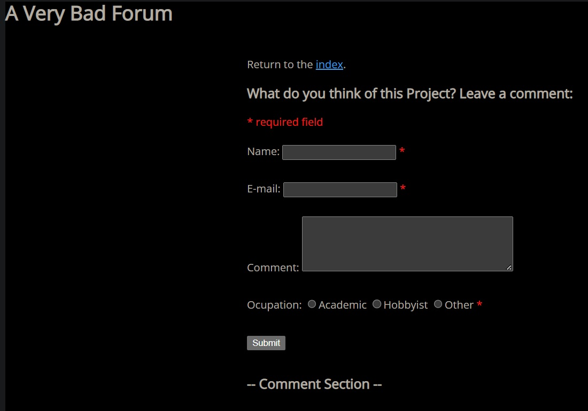

AIRES at PUCRS is making [teeny-tiny_castle](https://github.com/Nkluge-correa/teeny-tiny_castle) available to the public — a code repository aimed at giving researchers interested in working on AI ethics and safety issues the tools they need, built in [_Python_](https://www.python.org/).

In this repository, you'll find _notebooks and scripts_ showing how to build and use tools to address certain questions we work on in _AI ethics and safety_ (e.g., [**interpretability**](https://en.wikipedia.org/wiki/Explainable_artificial_intelligence), [**sustainability**](https://www.technologyreview.com/2019/06/06/239031/training-a-single-ai-model-can-emit-as-much-carbon-as-five-cars-in-their-lifetimes/), [**fairness**](https://en.wikipedia.org/wiki/Fairness_(machine_learning)), [**robustness**](https://en.wikipedia.org/wiki/Adversarial_machine_learning)). You'll also find an introductory **Python+ML** ( - _Machine Learning -_ ) course to help you get started if you're not familiar with the language. The [Intro to ML](https://github.com/Nkluge-correa/teeny-tiny_castle/tree/master/ML%20Intro%20Course) section was designed to _give newcomers a grasp of some of the tools and abstractions that underpin ML_.

All the requirements and step-by-step instructions can be found in [teeny-tiny_castle](https://github.com/Nkluge-correa/teeny-tiny_castle). There you'll find a series of tutorials, examples, and tools for working with topics related to:

## _AI Ethics (Guidelines,_ [_Governance_](https://www.airespucrs.org/nota-tecnica-aires)_, Regulation, R&D)._

## _Sustainability in large-model development (how to measure and quantify the_ [_carbon footprint_](https://codecarbon.io/) _of ML-trained models)._

## _Interpretability and robustness in computer vision (tools for_ [_XAI_](https://en.wikipedia.org/wiki/Explainable_artificial_intelligence) _and Adversarial ML)._

## _Interpretability and Robustness in NLP (_[_LIME_](https://arxiv.org/abs/1602.04938) _for NLP, prompt-engineering playgrounds, text-mining examples)._

## _Interpretability in classification and prediction with tabular data (how to_ [_explain divergent classifications_](https://dalex.drwhy.ai/) _from ML-developed models)._

## _Fairness in machine learning (how to_ [_measure, quantify, and remedy_](https://aif360.mybluemix.net/) _algorithmic discrimination)._

## _Systemic security (how organizations should coordinate to_ [_protect and preserve_](http://password-security.airespucrs.org/) _their information infrastructure)._

This repository is a work in progress, being built as part of the RAIES initiative ([Network for Safe and Trustworthy Artificial Intelligence](https://www.raies.org/)), a project supported by [FAPERGS](https://fapergs.rs.gov.br/inicial) (Foundation for Research Support of the State of Rio Grande do Sul). If you're interested in collaborating on the project, [contact us](https://www.airespucrs.org/contato)!
