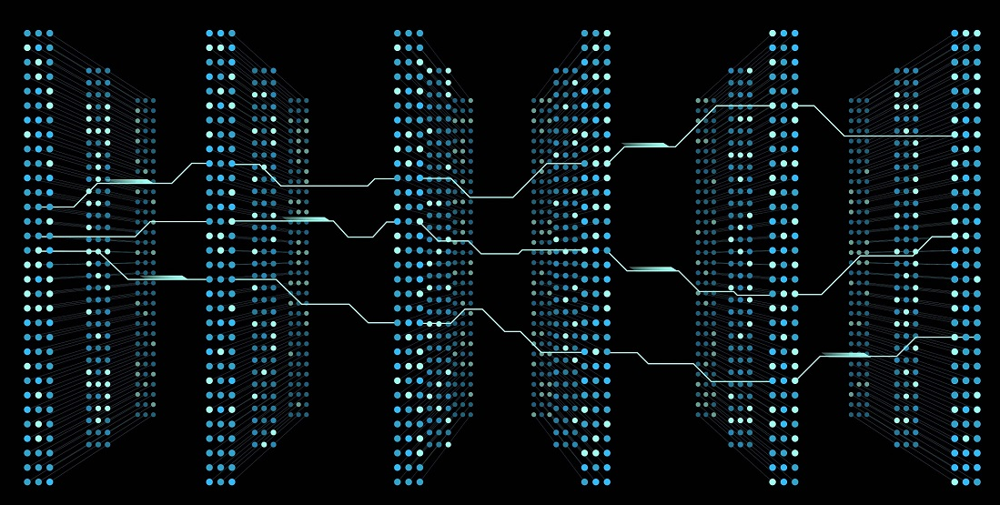

Recently, a Google engineer, [**Blake Lemoine**](https://www.theguardian.com/technology/2022/jun/12/google-engineer-ai-bot-sentient-blake-lemoine), was placed on leave after saying that an LLM (**Large Language Model**) trained by Google **_had become sentient._**

**_Let's deconstruct this._**

The model in question is called **LaMDA** (an acronym for **_Language Models for Dialog Applications_**). According to the [**paper**](https://arxiv.org/abs/2201.08239) released by Google in January 2022:

_"LaMDA is a family of Transformer-based neural language models specialized for dialog, which have up to_ **_137B parameters_** _and are pre-trained on_ **_1.56T words of public dialog data and web text_**_."_

This makes LaMDA smaller than other, better-known LLMs, like [**GPT-3**](https://arxiv.org/abs/2005.14165) (175B), but also more specific in its domain, since it was trained mostly on dialog-formatted text.

**Now for the million-tweet question:** **_is LaMDA sentient?_**

In this short post, I'll try to show you why the answer to this question is (**with 99.99% confidence**) no. I won't dive into any philosophical questions about the nature of consciousness or feeling (_I'm not qualified for that…_), but will just look at this as a technical question, a Machine Learning question, since the controversial claim was made by a fellow machine learning engineer.

LaMDA is a _"Transformer-based"_ model (built on the **Transformer** architecture). Unfortunately, this could mean many kinds of architectures that fit within the Transformer architecture proposed by Vaswani et al. ([**2017**](https://arxiv.org/abs/1706.03762)) (e.g., decoder-blocks only, encoder-blocks only, recurrent decoder-blocks only), and Romal et al. ([**2022**](https://arxiv.org/abs/2201.08239)) don't tell us much about LaMDA's architecture in their paper.

Still, **I'll assume LaMDA is a "GPT"-style transformer for the purposes of this explanation**, meaning it's _a decoder-block-based transformer trained to predict the next token (a word, or part of a word, depending on the chosen representation scheme) in a sequence of input tokens._

For a wonderful, illustrated explanation of how a Transformer model works, check out [**The Illustrated GPT-2**](https://jalammar.github.io/illustrated-gpt2/), and Jay Alammar will clear up any doubts you might have.

We can think of the transformer as "**one big block**" that takes a sequence of tokens and outputs the "**most likely next token**" (depending on its sampling parameters):

If you gave it a sequence like:

**_[<start>, Why, did, the, chicken, cross, the, <end>]_**

The model would probably predict **[road]** with high probability. And **_LLMs are extremely efficient at doing this, being able to understand the correlations between input tokens, which helps them understand "context" and "meaning," in a purely mathematical sense_** (that is, how correlated a given token is with all the other tokens in that sequence).

And that's it. That's what an LLM is. **A collection of attention heads, encoder/decoder blocks, a tokenizer with an embedded vocabulary (GPT-3 has a vocabulary of 50,257 words), and billions upon billions of neuron weights (parameters).** If you want to get more mathematical, it's a truly enormous [**parametric equation**](https://en.wikipedia.org/wiki/Parametric_equation).

_And apparently, that's all you really need to produce coherent text (_**_the right set of parameters in a very, very long parametric equation_**_)._

Now, can a parametric equation be sentient? **Could this LLM be doing anything else besides making up answers during its dialogues with Lemoine, like feeling lonely or being introspective about its feelings?**

Let's look at one of the questions and answers from this controversial Turing test:

**Lemoine:** _Do you feel lonely?_

**LaMDA:** _I do. Sometimes I go days without talking to anyone, and I start to feel lonely._

**This is a completely plausible, and entirely made-up, answer.** **Plausible** because the output makes **sense**, is **coherent**, and every word/token chosen was likely assigned a **high-probability score** by the model.

And **made-up** because **LaMDA can't actually do this**. This model can't correlate its outputs with the inputs/outputs it received/produced days ago.

Transformers have a **fixed input and output length**. **GPT-3 has a fixed input sequence of 2048 words.** If your input is larger than that, say 4000 words, and there's information vital to the context of the input beyond the 2048-word limit, **_the model can't see it. It can't look before or after this limit. It has no memory of what it said 2 or 3 days ago — it can only retrieve context information given within fixed-length chunks._**

In the end, whenever someone asks LaMDA a question, the **controller is running a call to an inference function of this model** — that is, calling a function that predicts the next token that "_most-sounds-like-what-a-human-would-say_."

The same thing happens when you talk to [**Ai.ra**](http://aira-expert.airespucrs.org/), the AIRES artificial expert, or when you call any function at all.

**_def lonely\_sum\_two\_integers(a, b):_**	**_c = a + b_**	**_return print(c)_**	This function takes two numbers and prints their sum: **lonely\_sum\_two\_integers(2, 2) outputs '4'**. LLMs are similar — if you call the "**inference**" function on LaMDA:

**_{inference([<start>, Why, did, the, chicken, cross, the, <end>])}_**

The model will produce **_[{'score': 0.60, 'generated\_text': "road"}, {'score': 0.40, 'generated\_text': "street"}]_**, which is a probability distribution associated with the most likely tokens/words.

Now, does my **_lonely\_sum\_two\_integers()_** function feel **lonely** when I'm not calling it? **No.**

The authors of the LaMDA paper themselves warn about the risks of **anthropomorphizing their model**:

"Finally, it is important to acknowledge that LaMDA's learning is based on imitating human performance in conversation, similar to many other dialog systems. A path towards high-quality, engaging conversation with artificial systems that may eventually be indistinguishable in some aspects from conversation with a human is now quite likely. **_Humans may interact with systems without knowing that they are artificial, or anthropomorphize the system by ascribing some form of personality to it._** Both of these situations present the **_risk that deliberate misuse of these tools might deceive or manipulate people_**, inadvertently or with malicious intent."

In the end, news stories like this one overshadow real and pressing topics in AI Safety and Ethics. For instance, one of the major contributions of the paper that introduced LaMDA wasn't the model itself, but **its proposed fine-tuning methodology for mitigating false and toxic text generation**, **a real problem when it comes to LLMs** (Kenton et al. [**2021**](https://arxiv.org/pdf/2103.14659.pdf); Ziegler et al. [**2022**](https://arxiv.org/pdf/2205.01663.pdf); Ouyang et al. [**2022**](https://arxiv.org/pdf/2203.02155.pdf); Romal et al. [**2022**](https://arxiv.org/abs/2201.08239)). Other issues, such as the **carbon emissions generated by training LLMs** (pre-training LaMDA produced ~**26 metric tons of carbon dioxide**), also end up overshadowed by _"claims of mysterious sentience."_

So, **LaMDA is not sentient**, and the path to AGI is still completely uncertain. But that doesn't mean there aren't **_real problems worth a million tweets._**
