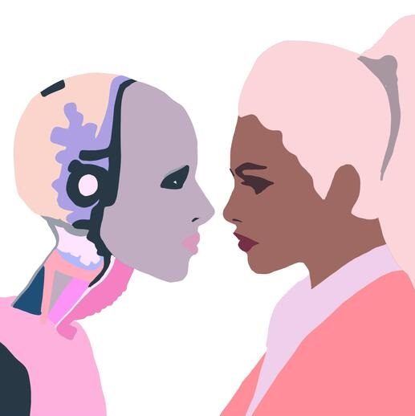

[**_Camila Palhares Barbosa_**](mailto:camilabarbosa.ri@gmail.com) 
_PhD in Philosophy from the Pontifícia Universidade Católica do Rio Grande do Sul_

The relationship between gender and knowledge has been one of the central topics of debate within the feminist movement. More specifically, the demand for women's fair and equal access to education and to the possibility of producing knowledge dates back to the earliest texts considered **_"feminist."_** In [A Vindication of the Rights of Woman (1791)](https://en.wikipedia.org/wiki/A_Vindication_of_the_Rights_of_Woman), Wollstonecraft states that _"the rights for which women, along with men, must fight, [...] are the natural consequence of their education and their position in society."_ The pursuit of breaking women free from confinement to the private and domestic sphere remained a foundation of feminist thought — whether through inclusion in education and democratic processes in the first wave, through entry into the labor market and self-autonomy in the second wave, or through equal opportunity for different women across particular situations in the public sphere in the movement's third wave. Despite the countless glass ceilings the movement has broken, we women still remain on the margins of many spaces of knowledge — such as academic faculties, senior positions in private companies, government leadership, and even in fields still seen as masculine, such as science and technology.

**_The parity of participation of women, non-white people, LGBTQ+ people, and other marginalized groups in fields of knowledge is, without a doubt, a requirement for achieving any model of a just and truly democratic society._** Moreover, these groups find in these spaces a place of resistance and discomfort due to heteronormative, misogynistic, and racist structures that alienate these subjects from these activities — claims that have already been widely made.

The provocation of the question **_"Can women be cyborgs?"_**, however, goes beyond the question of women's equal access to the field of technology and artificial intelligence development — it seeks to investigate whether gender issues carry implications for the content of knowledge itself, that is, how perceptions of gender distinctions affect the supposedly universal and transcendent content of objective knowledge, especially as artificial intelligence systems seem to render definitions of sex and gender obsolete.

## Feminist epistemology: a critique of disembodied universal reason

In "The Man of Reason" (1985), Genevieve Lloyd points to the masculine character that notions of rationality and knowledge have hidden behind assumptions of universality and objectivity throughout the history of philosophical thought. According to the author, "our belief that reason knows no sex has, I argue, largely deceived itself," since the separation of forms of knowledge into the 'rational' and the 'passionate' allowed for the exclusion or hierarchization of the content of knowledge — which, given the gender distinctions that structure society, produces "not just practical, but also conceptual, reasons for the conflicts that many women experience between Reason and femininity" (LLOYD, 1985, p. 10). Echoing this perspective, Alison Jaggar, in "Love and Knowledge: Emotion in Feminist Epistemology" (1989), clarifies how the confinement of notions of knowledge to dichotomous models, which strip sensory experience of the possibility of informing objective knowledge, contributed to the valuing of certain concepts of knowledge:

"Typically, though not invariably, the rational has been contrasted with the emotional, and this contrasting pair has then often been linked with other dichotomies. Not only has reason been contrasted with emotion, it has also been associated with the mental, the cultural, the universal, the public, and the male, while emotion has been associated with the irrational, the physical, the natural, the particular, the private, and, of course, the female" (JAGGAR, 1989, p. 151).

The field of feminist epistemology has recently focused on confronting the problem of gender in relation to the objectivity of knowledge. For many individuals on the margins of the production of science, technology, and knowledge, thinking of it as disinterested, impartial, and free of value judgment seems to clash with their own experience of the history of modern science.

Sandra Harding, in "Whose Science? Whose Knowledge?: Thinking from Women's Lives" (1986), articulates three important and distinct feminist epistemological programs:

Feminist empiricist philosophy — which seeks to correct "bad science";

Feminist standpoint theory — which builds knowledge from women's particular experience;

Postmodern feminism — which is suspicious of commitments to the Enlightenment project of the sciences and epistemologies (HARDING, 1986, p. 11).

These epistemological programs bring, in different ways, questions and contributions toward a kind of feminist method — an investigation committed to a critical analysis of objectivity that reveals the masculine patterns underlying standard methods of knowledge. According to Harding (1986, p. 41):

"One way to see this problem is to realize that although scientific methods are selected, it is said, precisely to eliminate all social values from inquiry, they are actually operationalized to eliminate only those values that differ within whatever is deemed acceptable by the community of scientists. If values and interests that might produce more critical perspectives on science are silenced through social actions and discriminatory practices, the standard, narrowly conceived as scientific method, will not have the slightest chance of maximizing value-neutrality or objectivity."

The tension exposed by feminist epistemology's critiques, both of the social and the natural sciences, has been that of the relationship between power and knowledge. Numerous critiques have focused on exposing that the universal scientific method, in fact, investigated and debated problems relative only to male experience, that scientific narratives served the interests of white men, and that the entire symbolic order through which knowledge is claimed was articulated in a way that privileged the masculine while conceptualizing the feminine only as that which lacked masculinity. The critique of objectivity — that knowledge of the world as it is, independent of the knowing subject — sought to demonstrate that such knowledge inevitably carries traces of subjectivity within methods considered universal.

Many of these feminist methodologies have pointed to the situated nature of knowledge. A situated epistemological view, as argued by several authors, does not necessarily represent relativism, but proposes, as a methodological starting point, that objectivity and subjectivity are not two opposites within scientific inquiry, but can be constructed dialectically (see FIUMARA, LAZREG, 1994). In other words, objectivity and subjectivity are in a constant process of formation.

In "Situated Knowledges: The Science Question in Feminism and the Privilege of Partial Perspective" (1995), Donna Haraway argues that "the alternative to relativism is partial, locatable, critical knowledges sustaining the possibility of webs of connections called solidarity in politics and shared conversations in epistemology" (HARAWAY, 1995, p. 24). Thus, situated knowledge is not located in some fixed position opposed to the totalizing, universal one; rather, it lies in a "practice of objectivity that privileges contestation, deconstruction, network connections, and hope for the transformation of systems of knowledge" — one capable of knowing the world in ways less organized around axes of domination over knowledge. Haraway's proposal is of a different vision of objectivity, and here I say 'vision' because of the emphasis the author places on the sensory, bodily dimension of sight to situate us in the world — not in a strictly passive way in relation to the object of knowledge, but as "active perceptual systems, building specific ways of translating and seeing" (HARAWAY, 1995, p. 22). Vision, Haraway emphasizes, depends on what we are able to see, on systems of perception that produce meaning in the world, on positioning oneself as an eye that sees, translates, describes, and reproduces. With this, what is meant to be discarded is the totalizing production of knowledge — one that disguises its masculine position as universal and complete — in favor of a vision of:

"[...] the knowing self [that] is partial in all its guises, never finished, whole, simply there and original; it is always constructed and stitched together imperfectly, and therefore able to join with another, to see together without claiming to be another. Here is the promise of objectivity: a scientific knower seeks the subject position not of identity, but of objectivity, that is, partial connection" (HARAWAY, 1995, p. 26).

A critique of objectivity, however, does not mean we should throw the baby out with the bathwater — as Marnia Lazreg rightly points out in "Women's Experience and Feminist Epistemology" (1994). A question that remains relevant to the critique of disembodied science, one that refuses to let experience count as a form of knowledge, is whether all experience is equally valid as knowledge — that is, whether a 'feminist scientific method' contains, or needs to contain, well-defined scientific criteria of analysis. As Haraway aptly puts it, relativism falls into the same general problem as objectivism, a "god trick": while objectivism is knowledge from nowhere (transcendent), relativism promises to be knowledge from everywhere at once and equally (omnipresent). Knowledge needs to be seen as partial and situated, not relative, in a process of emergence.

After all, an epistemological view of women's experience must also avoid falling into the essentialist traps that feminism seeks to critique — that is, it cannot be taken as a fixed, total, situated location, since, as we have seen in recent debates, especially after the third wave of the feminist movement, the category 'woman' as a specific standpoint of knowledge ignores the multiplicity and variety of experiences and intersections of human life, which cut across issues beyond gender, such as race, ethnicity, nationality, and sexuality, for example. Lazreg's conclusion highlights that:

"The choice is not between science and experience, objectivity and subjectivity. The point is to realize that objectivity is an ever-receding goal and that striving to achieve it is an endless historical process" (LAZREG, 1994, p. 59).

Scientific inquiry committed to feminist critique seems to point to the insufficiency of the dominant models that establish criteria of rationality and objectivity as a view situated nowhere yet capable of seeing the object of research in its totality. This claim to universality has resulted, across the most diverse fields — social, natural, and exact sciences — in obscuring a standard that favors a masculine view of the world. With this, we have a recent recognition that knowledge is situated in a world structured by gender configurations, since, after all, the scientists who see, translate, and represent the reality of the world are themselves situated within these gendered locations.

A point of intersection between gender, robotics, and artificial intelligence for the debate on knowledge in the sciences and technologies emerges to the extent that these systems appear to be free from the limits of gender and, therefore, from its effects on the resulting forms of knowledge. Furthermore, we might ask in what sense these technologies tend to influence our current concepts of sexual and gender difference.

## Gender and Artificial Intelligence

The description offered by Lloyd in "The Man of Reason" (1985) points to a pursuit, running through the history of philosophy, of a kind of purer knowledge and reason, free from any influence of human passions and embodiment. In a certain sense, we can see artificial intelligence systems as the form in which this pure reason reaches its greatest potential. The question that arises, once we commit to a feminist epistemological methodology as described, is: can there, after all, be gender biases in the field of Artificial Intelligence?

At first glance, the narrative of these disembodied systems, which cannot be classified as feminine/masculine, male/female, man/woman, seems to bring hope for a kind of knowledge that transcends the limits of these Enlightenment-era dichotomies.

Certainly, as claimed by women in the fields of science, technology, and Artificial Intelligence development, the lack of parity in the participation of women, as well as of other marginalized social categories, implies that many of the systems developed seek to answer strictly masculine demands, alienating the problems of other subjects in the technological field. This does not necessarily imply, however, that Artificial Intelligence — like the 'reason of man' objectivity that Lloyd described — hides masculine knowledge behind a claim of neutrality.

The techno-feminist debates begun in the 1990s, initiated by Judy Wajcman, emphasize that "technologies dominated by men conspire to diminish the relevance of 'women's' technologies, such as horticulture, cooking, and care work." Ferrando, in "Is the Post-Human a Post-Woman? Cyborgs, Robots, Artificial Intelligence and the Futures of Gender: A Case Study" (2014), analyzes how the historical networks of connections that contextualize and situate the conception of the 'human' also form a history that situates the understanding of what constitutes these technological systems, such as that of a cyborg, for example.

Furthermore, Susan Leavy, in "Gender Bias in Artificial Intelligence: The Need for Diversity and Gender Theory in Machine Learning" (2018), argues that gender biases can be identified in AI models, mainly due to the influence that language — steeped in gender dichotomies — has on the construction of algorithms and the learning of these machines. For Leavy, "the machine learns primarily by observing the data it is presented with [...] while a machine's ability to process large volumes of data may partly solve this, if the data is laden with stereotyped concepts of gender, the resulting application of the technology will perpetuate these biases" (p. 14).

Since at least the 1970s, feminists have investigated the role of language in gender dynamics, as Leavy points out: "gender ideologies are still embedded in textual sources and result in machine-learning algorithms that display stereotyped concepts of gender." The use of the terms "men" and "women," for example, is associated with distinct roles, representations, and labels: algorithms show recurring use of the term "family man," with no equivalent for women, while terms such as "single mother," "working mother," and "career woman" serve to describe preconceptions about women's social role; moreover, the masculine designation being used as universal teaches algorithms to perceive certain functions as assigned to men. Also, the descriptive terms associated with men and women vary considerably: the term 'girl' is used more than half the time to refer to women, while less than 30% of uses of 'boys' are attributed to men; the term 'wife' is used far more often than the term 'husband.'

In another example, in 2013, UN Women, in association with advertising agencies, published the search algorithms related to women in Google's search tool, in order to show what appears when you search Google about women. When typing "women shouldn't," autocomplete suggestions included "have rights," "vote," "work"; or, when searching "women should," the searches autocompleted with "stay at home," "be in the kitchen," "be submissive," etc. In 2016, Google confirmed the removal of suggestions related to these terms from its system — today, typing "woman" or "women" yields no such suggestions. Still, the challenge remains: to the extent that the algorithm generating such content continues to reproduce all manner of biases. The 'autocomplete' feature attempts to 'predict' users' thoughts based on the data generated by the algorithms. As a result, autofill could, in fact, influence a search the user never even intended to make in the first place. Several authors point to the way these systems perpetuate gender stereotypes.

Along these lines, in "Constructions of Gender in the History of Artificial Intelligence" (1996), Alison Adam also presents a discussion of how ideas can be gendered and produced in the field of AI to be associated with notions of the masculine and the feminine. Adam argues that the models of reasoning and intelligence in the field of AI essentially involve epistemological problems of two orders: who is the ideal knower, and, in terms of what can be known (ADAM, 1996, p. 48). The general epistemological assumption that "S knows that P" is the only adequate form of knowledge assumes that all knowledge must be propositional — meaning that whatever is not propositional cannot count as knowledge, which excludes practical skills and know-how from the field of knowledge. For Adam, the symbolic field of knowledge in Artificial Intelligence remains in pursuit "of the disembodied ideal of the 'Man of Reason'" (ADAM, 1996, p. 49). Problem-solving systems, as far back as the earliest AI models, such as Newell, Simon, and Shaw's "Logic Theorist," proceed from the assumption of the masculine ideal of reason, insofar as:

"In itself, we should not take for granted the idea that solutions to problems are things to be searched for. The idea of search is a fundamental part of symbolic AI. Search techniques are based on the ideal Cartesian method of deduction, and this disguises the need to look at how other forms of problem-solving based on intuition (seen as a less prestigious form of reasoning) or creative leaps might be represented where a search is not ostensibly part of the process" (ADAM, 1996, p. 49).

Adam concludes that the field of robotics and artificial intelligence can confront questions of situated and embodied knowledge, in which "intelligence is not seen as the individual's construction of a mental representation of the world, but rather as an emergent phenomenon resulting from the individual's interactions with their environment" (ADAM, 1996, p. 51). The "COG" project developed at MIT, according to Adam, advances the hypothesis of situated knowledge for the field of Artificial Intelligence, insofar as the system "was based on the hypothesis that human-level intelligence requires gaining experience through interaction with humans, as human infants do."

## Can women be cyborgs?

Recent research examining gender roles and Artificial Intelligence systems points out that the content taken to be 'knowledge' in these systems maintains paradigms long criticized by currents within feminist epistemology: that the supposed neutrality, objectivity, and universality of what we can categorize as knowledge conceal criteria that favor a masculine view of the world regarding what can be known and who can know it. Furthermore, the types of problems and solutions these AI systems handle still largely continue to respond to the demands of a male-dominated world.

The barrier to women's integration into the world of science and technology is not only related to their lack of access and participation — although that contributes to the diagnoses discussed here — but also lies in their alienation from what these systems seek to analyze, optimize, maximize, and know. Tools are still needed so that we can integrate a kind of 'feminine' knowledge, or rather, multiple experiences of the world, into what we call knowledge, so that women can finally become part of the imaginary of these new circuits and systems.

The image of the cyborg — that hybrid cybernetic organism of machine and living creature, which is a real and, at the same time, fictional social creature, producing an ambiguous notion of the natural and the constructed — is described by Haraway as the creature of a 'post-gender' world, even though Haraway herself dislikes the term 'post-gender' (HARAWAY, 1991, p. 150), insofar as it transgresses the dichotomous divisions that structure conceptions of gender. Haraway states that:

"A cyborg world might be about lived social and bodily realities in which people are not afraid of their joint kinship with animals and machines, not afraid of permanently partial identities and contradictory standpoints" (HARAWAY, 1991, p. 154).

The provocation of the question 'Can women be cyborgs?' seeks to reveal precisely the still-masculine character, grounded in Lloyd's 'man of reason' model, within the field of robotics and artificial intelligence.

The integration of the lived body with technology, in the sense that Paul Preciado describes as "productions of biotechno-political subjectivities" (2018), certainly opens space for the imaginative creation of forms of existence that transgress Enlightenment dichotomies and gender roles: the use of the contraceptive pill and the morning-after pill removes from women the deterministic reproductive role; the application of testosterone gives female bodies access to attributes legitimized and valued as exclusively masculine; the strap-on serves as a technology for co-opting power within a phallocentric society.

However, it still seems that our transformation into a cyborg reality, as described in Haraway's manifesto, still requires an epistemological paradigm shift — one in which our knowledge and imagination of the world becomes capable of describing more multiple and diverse experiences, with problems, demands, and solutions different from those pre-established by masculine reason.

Ferrando, in a questionnaire administered to students in the Cybernetics Department at the University of Reading (England), aiming to determine perceptions and representations of gender in the field of robotics and AI, points out that the majority of survey participants — over a thousand in number — associated the cyborg with the masculine or the neutral, but none associated the image of the cyborg with the feminine (FERRANDO, 2014, p. 6). For Ferrando, technology "is not only performed, but is first imagined" (FERRANDO, 2014, p. 7) — it is culturally situated imagination that informs what we intend to know. Thus, "if the genealogy of knowledge that silently informs AI is reduced to a masculine legacy, social exclusivism and biological determinism may be re-inscribed into its ontology, with the consequent risk that the defining differences of robots may assimilate human-centered practices and their discriminations" (FERRANDO, 2014, p. 7).

"For this reason, the deployment of critical frameworks such as Feminist Epistemology, the Philosophy of Sexual Difference, Critical Race Theory, Postcolonial Studies, Queer Theory, Disability Studies, and Intersectionality, among others, is seen as crucial in developing post-human epistemologies that inform technological fields. Adopting such viewpoints will allow humans to generate an empathic approach, preventing them from turning the robot into their new symbolic other, and from falling into the dualistic paradigm that has historically characterized hegemonic Western accounts, articulated in opposites such as: masculine/feminine, white/black, human/machine, self/other" (FERRANDO, 2014, p. 16).

This leads us to realize that parity of participation and diversity across all fields of knowledge is not merely an ethical commitment to egalitarian principles, but is also the path by which the content of our knowledge, and of the problems we intend to solve with new technologies, can encompass a world closer to the real one: one that is situated, partial, historical, and made of standpoints. This feminist methodological commitment, it should be made clear, does not imply the complete abandonment of notions of objectivity, of reality, or of specific criteria for scientific research; rather, it opens paths for an ongoing debate over new paradigms, new worlds, and, above all, new ways of knowing the world that situates us.

## References

- ADAM, Alison. (1996). Constructions of Gender in the History of Artificial Intelligence. IEEE Annals Of the History of Computing, 18(3).
- FERRANDO, Francesca. (2014) Is the post-human a post-woman? Cyborgs, robots, artificial intelligence and the futures of gender: a case study. European Journal of Futures Research volume, 2(43). doi: 10.1007/s40309-014-0043-8.
- HARAWAY, Donna. (1995) Situated Knowledges: The Science Question in Feminism and the Privilege of Partial Perspective. Cadernos Pagu, (5), 07-41.
- HARAWAY, Donna. (1991). Simians, Cyborgs, and women: the invention of nature. New York: Routledge.
- HARDING, Sandra G. (1986). Whose science? whose knowledge?: thinking from women's lives. New York: Cornell University Press.
- JAGGAR, Alison M. (1989) Love and knowledge: Emotion in feminist epistemology, Inquiry: An Interdisciplinary Journal of Philosophy, 32:2, 151-176.
- LAZREG, Marnia. (1994). Women's experience and the feminist epistemology. In: LENNON, Kathleen; WHITFORD, Margaret. (ed.) Knowing the difference: feminist perspectives in epistemology. New York: Routledge.
- LEAVY, Susan. (2018) Gender Bias in Artificial Intelligence: The Need for Diversity and Gender Theory in Machine Learning. ACM/IEEE 1st International Workshop on Gender Equality in Software Engineering. doi: 10.1145/3195570.3195580.
- LLOYD, Genevieve. (1985). The man of reason. Minneapolis: University of Minnesota Press.
