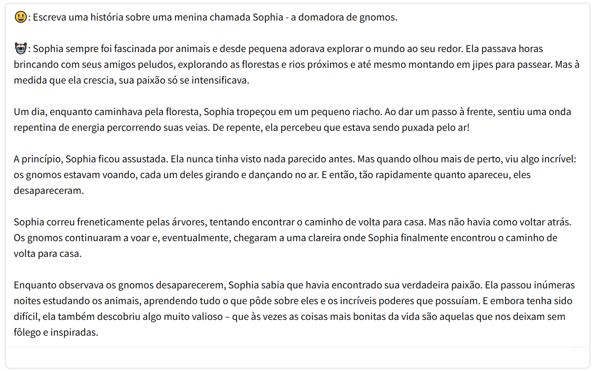

Large language models (LLMs) have significantly advanced the field of natural language processing, but this progress still isn't evenly distributed across languages. In this project, we document the development of a pair of open-source language models, adapted for use in low-resource settings, trained in the Portuguese language. This is the TeenyTinyLlama pair: two compact models for text generation in Brazilian Portuguese. We released them under a permissive license (Apache 2.0) on [GitHub](https://github.com/Nkluge-correa/TeenyTinyLlama) and [Hugging Face](https://huggingface.co/collections/nicholasKluge/teenytinyllama-6582ea8129e72d1ea4d384f1) for community use and further development.

The study below was developed as part of the RAIES initiative ([Network for Safe and Trustworthy Artificial Intelligence](https://www.raies.org/)), a project supported by FAPERGS ([Foundation for Research Support of the State of Rio Grande do Sul](https://fapergs.rs.gov.br/inicial)), Brazil.

Access it [here](https://nkluge-correa.github.io/TeenyTinyLlama/).
